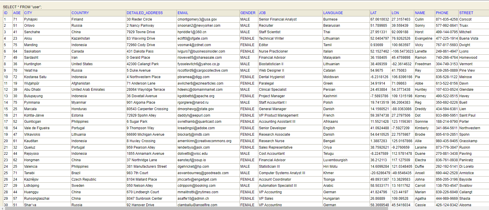
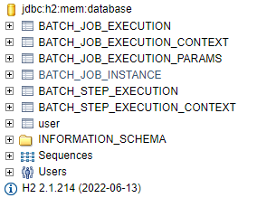

# Spring Boot Batch Processing Example

Spring Batch is a lightweight and open-source framework that allows the running of scalable batch processing operations. It is generally preferred when processing large amounts of data. For example, "batch processing" can be used while generating reports


#### CSV File (generated by mockaroo.com)

[https://github.com/gurkanucar/batch-processing-example/blob/master/src/main/resources/MOCK_DATA_1K_Rows.csv](https://github.com/gurkanucar/batch-processing-example/blob/master/src/main/resources/MOCK_DATA_1K_Rows.csv)

### How to run

#### clone the project: https://github.com/gurkanucar/batch-processing-example

```bash
  git clone https://github.com/gurkanucar/batch-processing-example
```

#### run

```bash
  mvn run
```


## Example Images






## Res


[https://www.section.io/engineering-education/spring-boot-batch-processing/](https://www.section.io/engineering-education/spring-boot-batch-processing/)

[https://docs.spring.io/spring-batch/docs/current/reference/html/spring-batch-intro.html](https://docs.spring.io/spring-batch/docs/current/reference/html/spring-batch-intro.html)

[https://www.youtube.com/watch?v=1XEX-u12i0A](https://www.youtube.com/watch?v=1XEX-u12i0A)


